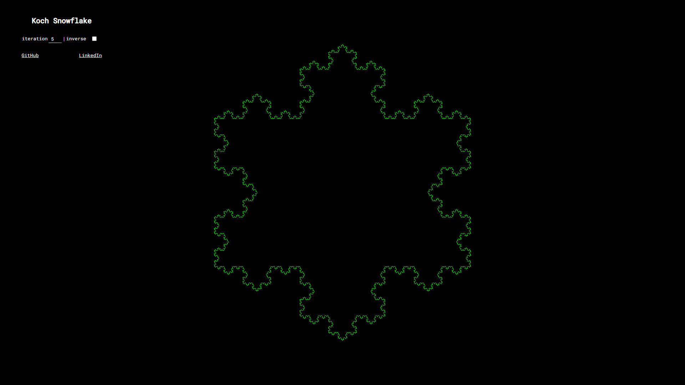
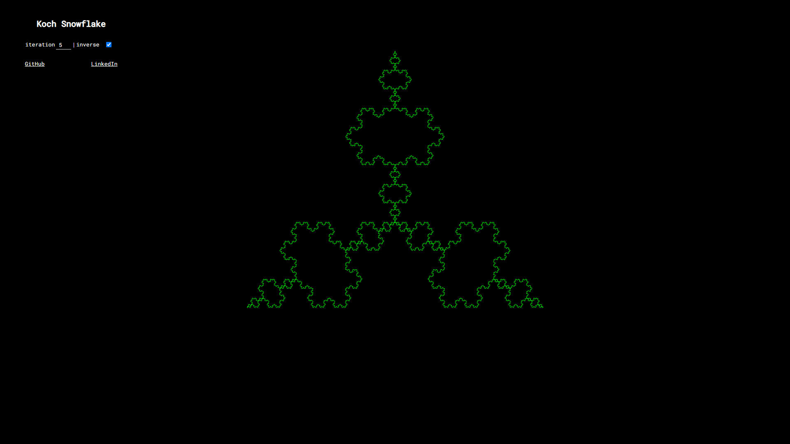

# Koch Snowflake

if you just want to play with it, follow, [FOLLOW THIS LINK](https://mhyrzt.github.io/KochSnowFlake/)

if you are curios about math of this project, [FOLLOW THIS LINK](https://github.com/mhyrzt/KochSnowFlake/blob/main/DESCRIPTION.ipynb)

## installation

```bash
git clone git@github.com:mhyrzt/KochSnowFlake.git
cd KochSnowFlake
npm i
npm start
```

### Normal



### Inverse


